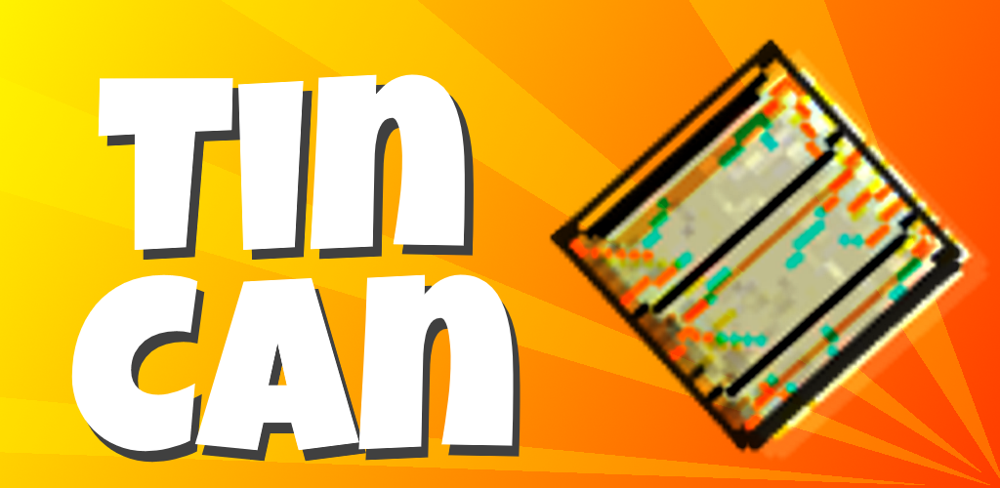

# Tin Can
> Mobile Arcade Game

This game ain't your typical can of beans. **Tin Can** is a minimal action-arcade game where you compete with yourself to obtain the highest score you can.


## Play the Game
If you just want to play, Tin Can is [available on the Google Play store](https://play.google.com/store/apps/details?id=io.chrislowe.tincan)!


## Prerequisites

* [Android Studio](https://developer.android.com/studio/)
* Enable developer mode on your Android phone


## Contributing

Thank you for your interest. **Tin Can** is written in [Kotlin](https://kotlinlang.org/) and utilizes the [LibGDX](https://libgdx.badlogicgames.com/) game framework.

If you'd like to contribute, please fork the repository and use a feature
branch. Pull requests are warmly welcome. Alternatively, let me know of any
issues you face by filing a report in the project's
[issue tracker](https://github.com/ChristianLowe/ThorsHammer/issues).

## Credits and Licenses

I could not make this entire project on my own. I am very thankful for those who provide their resources for free on the Internet.

### Music
```
"Bit Shift", "Pookatori and Friends"
Kevin MacLeod (incompetech.com)
Licensed under Creative Commons: By Attribution 3.0
http://creativecommons.org/licenses/by/3.0/
```

### Fonts
```
"Share Tech Mono"
Carrois Apostrophe
Licensed under the Open Font License
http://scripts.sil.org/cms/scripts/page.php?site_id=nrsi&id=OFL_web
```

```
"Luckiest Guy"
Astigmatic
Licensed under the Open Font License
http://scripts.sil.org/cms/scripts/page.php?site_id=nrsi&id=OFL_web
```

Software
--------
```
Copyright (c) 2018 Christian Lowe
Released under the MIT License

Permission is hereby granted, free of charge, to any person obtaining a copy of this software
and associated documentation files (the "Software"), to deal in the Software without restriction,
including without limitation the rights to use, copy, modify, merge, publish, distribute,
sublicense, and/or sell copies of the Software, and to permit persons to whom the Software is
furnished to do so, subject to the following conditions:

The above copyright notice and this permission notice shall be included in all copies
or substantial portions of the Software.

THE SOFTWARE IS PROVIDED "AS IS", WITHOUT WARRANTY OF ANY KIND, EXPRESS OR IMPLIED, INCLUDING
BUT NOT LIMITED TO THE WARRANTIES OF MERCHANTABILITY, FITNESS FOR A PARTICULAR PURPOSE
AND NONINFRINGEMENT. IN NO EVENT SHALL THE AUTHORS OR COPYRIGHT HOLDERS BE LIABLE FOR ANY CLAIM,
DAMAGES OR OTHER LIABILITY, WHETHER IN AN ACTION OF CONTRACT, TORT OR OTHERWISE, ARISING FROM,
OUT OF OR IN CONNECTION WITH THE SOFTWARE OR THE USE OR OTHER DEALINGS IN THE SOFTWARE.
```

Graphics and Sound Effects
--------------------------
```
Copyright (c) 2018 Christian Lowe
All rights reserved
```
